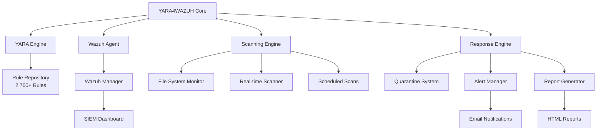
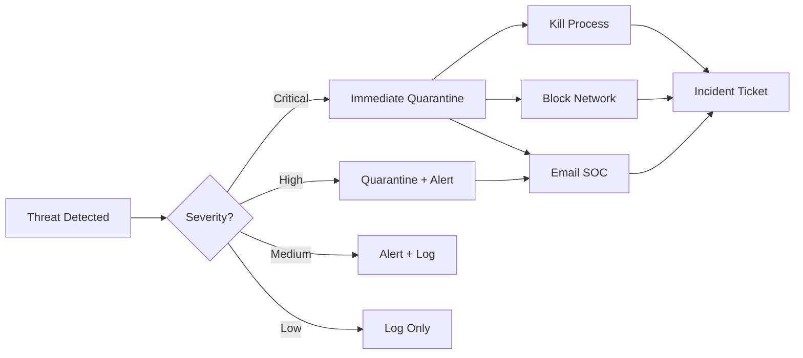

# YARA4WAZUH - Advanced Threat Detection Platform

[](https://github.com/paolokappa/yara4wazuh/releases)
[](LICENSE)
[](https://virustotal.github.io/yara/)
[](https://wazuh.com/)
[](https://www.linux.org/)
[](https://github.com/paolokappa/yara4wazuh/commits/main)
[](https://github.com/paolokappa/yara4wazuh/security)
[](https://hub.docker.com/r/paolokappa/yara4wazuh)
[](https://github.com/paolokappa/yara4wazuh/actions)

## 🎯 Overview

**YARA4WAZUH** is an enterprise-grade threat detection and response platform that seamlessly integrates YARA's powerful pattern matching engine with Wazuh's comprehensive security monitoring capabilities. This solution provides real-time malware detection, automated threat response, and comprehensive security reporting across your entire infrastructure.

### 🌟 Why YARA4WAZUH?

- **🚨 Proactive Threat Detection**: Identify malware, exploits, and suspicious patterns before they cause damage
- **⚡ Automated Response**: Instantly quarantine threats and trigger incident response workflows
- **📈 Scalable Architecture**: Deploy across unlimited servers with centralized management
- **🔍 Deep Visibility**: Integrate with Wazuh SIEM for comprehensive security monitoring
- **🎯 Low False Positives**: Optimized rules with intelligent filtering reduce noise
- **🔄 Always Updated**: Automatic rule updates from multiple threat intelligence feeds

## 📋 Table of Contents

- [🔑 Key Features](#-key-features)
- [💻 System Requirements](#-system-requirements)
- [🏗️ Architecture](#️-architecture)
- [🚀 Installation](#-installation)
- [⚙️ Configuration](#️-configuration)
- [📖 Usage](#-usage)
- [📦 Components](#-components)
- [🛡️ Security Features](#️-security-features)
- [📊 Monitoring & Reporting](#-monitoring--reporting)
- [🔧 Troubleshooting](#-troubleshooting)
- [⚡ Performance Optimization](#-performance-optimization)
- [🤝 Contributing](#-contributing)
- [📚 Documentation](#-documentation)
- [📄 License](#-license)

## 🔑 Key Features

| Feature | Description |
|---------|-------------|
| **🛡️ Real-time Protection** | Continuous monitoring with immediate threat response |
| **🤖 Intelligent Automation** | Automated scanning, quarantine, and alerting |
| **📊 Advanced Analytics** | Detailed threat intelligence and trending reports |
| **🔌 Native Integration** | Seamless Wazuh SIEM integration |
| **📧 Smart Notifications** | Priority-based email alerts with HTML formatting |
| **🔄 Auto-updating Rules** | 2,700+ rules updated from global threat feeds |
| **🎛️ Flexible Configuration** | Customizable scan schedules and thresholds |
| **📡 Remote Management** | Deploy and manage across entire infrastructure |
| **🔐 Secure Quarantine** | Isolated threat storage with forensic preservation |
| **📈 Performance Optimized** | Minimal system impact with efficient scanning |

## 💻 System Requirements

### Minimum Requirements

| Component | Minimum | Recommended |
|-----------|---------|-------------|
| **Operating System** | Ubuntu 20.04+ / Debian 10+ | Ubuntu 22.04 LTS |
| **CPU** | 2 cores @ 2.0GHz | 4 cores @ 2.4GHz |
| **RAM** | 4GB | 8GB |
| **Storage** | 20GB free | 50GB free |
| **Network** | 100 Mbps | 1 Gbps |
| **Wazuh Agent** | 4.0+ | 4.5+ |
| **YARA** | 4.0+ | 4.5.4 |
| **Python** | 3.6+ | 3.10+ |

### Software Dependencies

**All dependencies are automatically installed by the script based on your OS:**

#### Ubuntu/Debian:
```bash
# Automatically installed packages:
automake libtool make gcc pkg-config
libssl-dev libjansson-dev libmagic-dev
git curl wget sendmail mailutils
```

#### RHEL/CentOS/AlmaLinux/Rocky:
```bash
# Automatically installed packages:
automake libtool make gcc pkgconfig
openssl-devel jansson-devel file-devel
git curl wget sendmail mailx
```

#### YARA Compilation:
```bash
# The script automatically:
# 1. Downloads YARA 4.5.4 source code
# 2. Compiles with these modules enabled:
#    --enable-cuckoo
#    --enable-magic
#    --enable-dotnet
# 3. Installs system-wide
# 4. Updates library cache with ldconfig
```

## ✨ Automated Features

The `yara4wazuh.sh` installer provides complete automation:

### 🤖 What Gets Automated:

| Feature | Description | Manual Steps Saved |
|---------|-------------|--------------------|
| **OS Detection** | Automatically detects Linux distribution | No need to specify OS type |
| **Package Installation** | Installs all dependencies with correct package manager | 15+ packages |
| **YARA Compilation** | Downloads, compiles, and installs YARA from source | 8 compilation steps |
| **Directory Setup** | Creates complete directory structure with permissions | 10+ directories |
| **Script Deployment** | Deploys 23 helper scripts | Manual copying and permissions |
| **Rule Download** | Fetches rules from multiple repositories | 2,700+ rules |
| **Rule Optimization** | Deduplicates and optimizes rules | Performance tuning |
| **Wazuh Configuration** | Sets up complete integration | 5+ config files |
| **Cron Scheduling** | Creates all scheduled tasks | 7 cron jobs |
| **Email Setup** | Configures email notifications | SMTP configuration |
| **Testing** | Runs EICAR test to verify | Manual testing |
| **Reporting** | Sends installation report | Documentation |

### 🎛️ Supported Linux Distributions:

- ✅ **Ubuntu** (20.04, 22.04, 24.04)
- ✅ **Debian** (10, 11, 12)
- ✅ **RHEL** (8, 9)
- ✅ **AlmaLinux** (8, 9)
- ✅ **Rocky Linux** (8, 9)
- ✅ **CentOS** (7, 8 Stream)
- ✅ **Fedora** (Latest)

## 🏗️ Architecture

### System Architecture



### Deployment Topology

```
┌─────────────────────────┐
│   Master Server         │
│   - Wazuh Manager       │
│   - YARA4WAZUH Core     │
│   - Central Management  │
└───────────┬─────────────┘
            │
    ┌───────┴──────────┬──────────┬──────────┬──────────┐
    │                  │          │          │          │
┌───▼────┐     ┌──────▼───┐ ┌────▼────┐ ┌──▼───┐ ┌────▼────┐
│Server 1 │     │Server 2  │ │Server 3 │ │Server 4│ │Server N │
│  Agent  │     │  Agent   │ │  Agent  │ │ Agent │ │  Agent  │
└─────────┘     └──────────┘ └─────────┘ └──────┘ └─────────┘
```

### Core Components

| Component | Version | Description |
|-----------|---------|-------------|
| **YARA Engine** | 4.5.4 | High-performance pattern matching engine |
| **Wazuh Agent** | 4.x | Enterprise SIEM integration |
| **Rule Engine** | Latest | 2,700+ detection rules from global feeds |
| **Scanner Module** | 13.6 | Multi-threaded scanning with optimization |
| **Response Module** | 13.6 | Automated threat response and quarantine |
| **Reporting Engine** | 13.6 | HTML reports and analytics |
| **Automation Scripts** | 23 scripts | Complete operational automation |

## 🚀 Installation

### 🎯 Automated Installation

The `yara4wazuh.sh` script is a comprehensive installer that automatically handles all aspects of the deployment:

#### What the Installer Does:

1. **🔍 OS Detection & Package Management**
   - Automatically detects your Linux distribution (Ubuntu, Debian, RHEL, AlmaLinux, CentOS, Rocky Linux)
   - Installs all required dependencies using the appropriate package manager (apt/yum)
   - No manual package installation required

2. **📦 YARA Installation**
   - Downloads and compiles YARA 4.5.4 from source
   - Enables advanced modules: cuckoo, magic, dotnet
   - Configures system libraries with ldconfig
   - Verifies installation and version

3. **🛠️ Complete System Setup**
   - Creates directory structure (`/opt/yara`, `/var/log/yara`, `/var/ossec/quarantine`)
   - Sets appropriate permissions (700 for quarantine, 755 for others)
   - Deploys 23+ automation scripts
   - Downloads and optimizes 2,700+ YARA detection rules

4. **🔗 Wazuh Integration**
   - Configures active response scripts
   - Sets up custom decoders and rules
   - Enables remote command execution
   - Configures File Integrity Monitoring (FIM)

5. **⏰ Automation Setup**
   - Creates cron jobs for scheduled scans
   - Sets up automatic rule updates
   - Configures health monitoring
   - Enables log rotation

### 📥 Installation Command

```bash
# Clone the repository
git clone https://github.com/paolokappa/yara4wazuh.git
cd yara4wazuh

# Run the installer (requires root)
sudo ./yara4wazuh.sh

# The script will:
# 1. Check for root permissions
# 2. Detect your OS and install dependencies
# 3. Download and compile YARA 4.5.4
# 4. Setup complete directory structure
# 5. Deploy all scripts and configurations
# 6. Download and optimize YARA rules
# 7. Configure Wazuh integration
# 8. Setup scheduled tasks
# 9. Send installation report via email
```

### 🚀 Advanced Installation Options

```bash
# Install with custom YARA version
YARA_VERSION_OVERRIDE="5.0.0" sudo ./yara4wazuh.sh

# Install with custom email recipient
EMAIL_TO="security@yourcompany.com" sudo ./yara4wazuh.sh

# Install with GitHub repository for updates
GITHUB_REPO="https://github.com/yourorg/yara4wazuh.git" sudo ./yara4wazuh.sh

# Deploy only scripts without full installation
sudo ./yara4wazuh.sh --deploy-only

# Create deployment package for distribution
sudo ./yara4wazuh.sh --create-package
```

### 🔄 Post-Installation Management

```bash
# Update from GitHub repository
sudo ./yara4wazuh.sh --update-from-github

# Update all scripts to latest version
sudo ./yara4wazuh.sh --update-scripts

# Reinstall all scripts
sudo ./yara4wazuh.sh --reinstall

# Update YARA rules
sudo ./yara4wazuh.sh --update-rules

# Optimize rules database
sudo ./yara4wazuh.sh --optimize-rules
```

### 📡 Remote Deployment

Deploy YARA4WAZUH to multiple servers from a central location:

```bash
# Deploy to single server
./scripts/yara4wazuh_remote_migration.sh target.server.com

# Deploy to multiple servers
for server in $(cat servers.txt); do
    ./scripts/yara4wazuh_remote_migration.sh $server
done

# Deploy with custom SSH user
./scripts/yara4wazuh_remote_migration.sh target.server.com ubuntu

# Verify remote deployment
ssh target.server.com '/opt/yara/yara4wazuh.sh --status'
```

### 🐳 Docker Installation

```bash
# Pull official image
docker pull paolokappa/yara4wazuh:latest

# Run container
docker run -d \
  --name yara4wazuh \
  -v /var/log:/var/log \
  -v /opt/yara/config.local:/opt/yara/config.local \
  -e EMAIL_TO="security@company.com" \
  paolokappa/yara4wazuh:latest

# Docker Compose
docker-compose up -d
```

## ⚙️ Configuration

### 📝 Basic Configuration

Create a `config.local` file to customize your deployment:

```bash
cat > /opt/yara/config.local << 'EOF'
#!/bin/bash
# Local Configuration

# Company Information
export COMPANY_NAME="Your Company"
export COMPANY_WEBSITE="www.yourcompany.com"
export EMAIL_TO="soc@yourcompany.com"
export COMPANY_DOMAIN="yourcompany.com"

# Master Server
export MASTER_SERVER="master.yourcompany.com"
export MASTER_SERVER_IP="10.0.0.1"

# Scan Configuration
export SCAN_DIRS="/home /var/www /opt /tmp"
export EXCLUDE_DIRS="/proc /sys /dev /run"
export SCAN_SCHEDULE="0 2 * * *"  # Daily at 2 AM
export SCAN_TIMEOUT=3600           # 1 hour timeout

# Alert Configuration
export CRITICAL_THRESHOLD=10       # Critical alert if >10 threats
export WARNING_THRESHOLD=5         # Warning if >5 threats
export AUTO_QUARANTINE=true        # Auto-quarantine threats

# Performance Tuning
export MAX_THREADS=4               # Parallel scanning threads
export NICE_LEVEL=19               # CPU priority (19=lowest)
export MEMORY_LIMIT="2G"           # Max memory usage
EOF

chmod 600 /opt/yara/config.local
```

### 🔐 Advanced Configuration

#### Wazuh Integration Settings

```xml
<!-- /var/ossec/etc/ossec.conf -->
<ossec_config>
  <!-- File Integrity Monitoring -->
  <syscheck>
    <frequency>300</frequency>
    <directories realtime="yes" report_changes="yes">/home,/var/www</directories>
    <directories realtime="yes">/opt/yara</directories>
    <alert_new_files>yes</alert_new_files>
  </syscheck>

  <!-- Active Response -->
  <active-response>
    <command>yara-scan</command>
    <location>local</location>
    <rules_id>87100-87199</rules_id>
    <timeout>300</timeout>
  </active-response>

  <!-- Log Collection -->
  <localfile>
    <log_format>syslog</log_format>
    <location>/var/log/yara/*.log</location>
  </localfile>
</ossec_config>
```

#### YARA Rules Management

```bash
# Update rules from repositories
/opt/yara/scripts/update_rules.sh

# Optimize rules for performance
/opt/yara/scripts/optimize_rules.sh

# Test rule compilation
yara -C /opt/yara/rules/*.yar

# Add custom rules
cat > /opt/yara/rules/custom.yar << 'EOF'
rule Custom_Threat {
    meta:
        description = "Custom threat detection"
        author = "Your Company"
        date = "2025-01-01"
        severity = "critical"
    strings:
        $pattern1 = "malicious_pattern"
        $pattern2 = {6D 61 6C 77 61 72 65}
    condition:
        any of them
}
EOF
```

## 📖 Usage

### 🎮 Complete Command Reference

The `yara4wazuh.sh` script provides comprehensive management capabilities:

```bash
# Main management script
/opt/yara/yara4wazuh.sh [OPTION]

# Installation & Deployment
  (no option)             Perform complete installation
  --deploy-only          Deploy scripts without full installation
  --create-package       Create deployment package for distribution
  --reinstall            Reinstall all helper scripts
  
# System Management  
  --status               Show detailed system status
  --health-check         Perform comprehensive health check
  --version              Display version information
  
# Updates & Maintenance
  --update-rules         Update YARA rules from sources
  --optimize-rules       Optimize and deduplicate rules
  --update-scripts       Update all scripts to latest version
  --update-from-github   Pull latest updates from GitHub
  
# Removal
  --uninstall            Interactive uninstallation
  --uninstall-force      Force uninstall without confirmation
  
# Help
  --help                 Show detailed help message
```

### 📊 System Status Information

```bash
# Check complete system status
sudo ./yara4wazuh.sh --status

# Output includes:
# - YARA version and status
# - Number of active rules
# - Wazuh integration status
# - Recent scan results
# - Quarantine statistics
# - Scheduled tasks status
```

### 🔍 Version Information

```bash
# Display version details
./yara4wazuh.sh --version

# Shows:
# - Script version
# - YARA installed version
# - YARA target version for new installs
# - Company information
# - Support contact
```

### 🔍 Scanning Operations

```bash
# Quick scan of critical directories
/opt/yara/yara4wazuh.sh --scan

# Scan specific directory
/opt/yara/yara4wazuh.sh --scan /var/www

# Full system scan with report
/opt/yara/scripts/daily_scan.sh

# Fast scan with 5-minute timeout
timeout 300 /opt/yara/scripts/daily_scan_quick.sh

# Scan with specific rules
yara /opt/yara/rules/ransomware.yar /path/to/scan

# Recursive scan with threading
yara -r -p 4 /opt/yara/rules/optimized.yar /home
```

### 📊 Monitoring & Status

```bash
# System status overview
/opt/yara/yara4wazuh.sh --status

# Health check report
/opt/yara/scripts/health_check.sh

# Integration verification
/opt/yara/scripts/integration_status.sh

# Real-time log monitoring
tail -f /var/log/yara/daily_scan.log

# Wazuh alert stream
tail -f /var/ossec/logs/alerts/alerts.json | jq '.rule.groups[] | select(. == "yara")'

# Performance metrics
/opt/yara/scripts/check_status.sh
```

## 📦 Components

### 📂 Directory Structure

```
/opt/yara/
├── yara4wazuh.sh              # Main management script
├── config.local               # Local configuration (git-ignored)
├── config.template            # Configuration template
├── scripts/                   # Automation scripts
│   ├── common.sh             # Shared functions library
│   ├── daily_scan.sh         # Daily scanning routine
│   ├── health_check.sh       # System health monitor
│   ├── weekly_report_html.sh # Weekly report generator
│   ├── update_rules.sh       # Rule update manager
│   ├── optimize_rules.sh     # Rule optimization
│   └── ...                   # Additional utilities
├── rules/                     # YARA rules (auto-populated)
│   ├── optimized.yar         # Combined optimized ruleset
│   ├── custom/               # Custom organization rules
│   └── disabled/             # Disabled/problematic rules
├── logs/                      # Application logs
│   ├── daily_scan.log        # Scan results
│   ├── health_check.log      # Health monitoring
│   └── update.log            # Update logs
├── quarantine/               # Isolated threats
├── reports/                  # HTML reports
└── backup/                   # Configuration backups
```

### ⏰ Scheduled Tasks

| Task | Schedule | Purpose | Script |
|------|----------|---------|--------|
| Daily Scan | 2:00 AM | Full system malware scan | `daily_scan.sh` |
| Quick Scan | Every 6 hours | Critical directory scan | `daily_scan_quick.sh` |
| Health Check | 6:00 AM | System health monitoring | `health_check.sh` |
| Weekly Report | Monday 3:00 AM | Security summary report | `weekly_report_html.sh` |
| Rule Update | Sunday 1:00 AM | Update detection rules | `update_rules.sh` |
| Quarantine Cleanup | Daily 3:00 AM | Remove old quarantine | `quarantine_cleanup.sh` |
| Log Rotation | Daily 4:00 AM | Rotate and compress logs | `log_cleanup.sh` |

## 🛡️ Security Features

### 🎯 Threat Detection Coverage

| Category | Rules | Description |
|----------|-------|-------------|
| **Malware** | 1,200+ | Trojans, viruses, worms, backdoors |
| **Ransomware** | 150+ | All major ransomware families |
| **APT Groups** | 200+ | Nation-state and APT indicators |
| **Exploits** | 300+ | CVE-based exploit detection |
| **Webshells** | 100+ | PHP, ASP, JSP webshells |
| **Rootkits** | 80+ | Kernel and userland rootkits |
| **Cryptominers** | 50+ | Cryptocurrency mining malware |
| **Phishing** | 40+ | Phishing kits and pages |
| **PUPs** | 200+ | Potentially unwanted programs |
| **Custom** | Unlimited | Organization-specific rules |

### 🤖 Automated Response Workflow



### 🔐 Security Hardening

```bash
# Set secure permissions
chmod 700 /opt/yara/quarantine
chmod 600 /opt/yara/config.local
chmod 755 /opt/yara/scripts/*.sh
chown -R root:root /opt/yara

# Configure SELinux (if enabled)
semanage fcontext -a -t admin_home_t "/opt/yara(/.*)?"
restorecon -Rv /opt/yara/

# Enable audit logging
auditctl -w /opt/yara/quarantine -p rwxa -k yara_quarantine
auditctl -w /opt/yara/rules -p wa -k yara_rules

# Restrict network access
iptables -A OUTPUT -m owner --uid-owner yara -j DROP
```

## 📊 Monitoring & Reporting

### 📧 Email Reports

YARA4WAZUH generates professional HTML-formatted email reports:

| Report Type | Frequency | Contents |
|-------------|-----------|----------|
| **Daily Scan Report** | Daily 2:30 AM | Threats detected, scan statistics, top risks |
| **Weekly Summary** | Monday 3:00 AM | Trend analysis, threat distribution, recommendations |
| **Health Check** | Daily 6:30 AM | System status, performance metrics, errors |
| **Critical Alert** | Real-time | Immediate notification of critical threats |
| **Monthly Report** | 1st of month | Executive summary, metrics, compliance status |

### 📈 Dashboard Integration

#### Wazuh Dashboard Queries

```sql
-- Top YARA detections
SELECT rule.description, COUNT(*) as count
FROM alerts
WHERE rule.groups LIKE '%yara%'
GROUP BY rule.description
ORDER BY count DESC
LIMIT 10;

-- Threat trend (last 7 days)
SELECT DATE(timestamp) as date, COUNT(*) as threats
FROM alerts
WHERE rule.groups LIKE '%yara%'
AND timestamp > DATE_SUB(NOW(), INTERVAL 7 DAY)
GROUP BY DATE(timestamp);
```

### 📊 Key Performance Indicators

| Metric | Target | Measurement |
|--------|--------|-------------|
| **Detection Rate** | >95% | Threats detected vs known samples |
| **False Positive Rate** | <2% | False alerts vs total alerts |
| **Scan Performance** | >1000 files/sec | Files processed per second |
| **Response Time** | <5 seconds | Detection to quarantine time |
| **System Impact** | <10% CPU | Average CPU during scans |
| **Rule Coverage** | 100% | Active rules vs total rules |
| **Uptime** | >99.9% | Service availability |

## 🔧 Troubleshooting

### 🚨 Common Issues and Solutions

#### Issue: High CPU Usage During Scans

```bash
# Solution 1: Adjust scan priority
nice -n 19 /opt/yara/scripts/daily_scan.sh

# Solution 2: Limit scan threads
export MAX_THREADS=2
/opt/yara/scripts/daily_scan.sh

# Solution 3: Reduce scan scope
export SCAN_DIRS="/home /tmp"
/opt/yara/scripts/daily_scan.sh
```

#### Issue: Email Notifications Not Working

```bash
# Test email configuration
echo "Test" | mail -s "YARA4WAZUH Test" your@email.com

# Check mail logs
tail -f /var/log/mail.log

# Verify SMTP settings
postconf -n | grep relayhost
```

### 🔍 Advanced Diagnostics

```bash
# Enable debug mode
export DEBUG=1
export VERBOSE=1
/opt/yara/scripts/daily_scan.sh

# Performance profiling
time /opt/yara/scripts/daily_scan.sh
strace -c /opt/yara/scripts/daily_scan.sh

# System resource monitoring
htop -p $(pgrep -f yara)
```

## ⚡ Performance Optimization

### CPU Optimization

```bash
# Use CPU affinity
taskset -c 0,1 /opt/yara/scripts/daily_scan.sh

# Limit memory usage
ulimit -v 2097152  # 2GB limit
/opt/yara/scripts/daily_scan.sh
```

### I/O Optimization

```bash
# Use ionice for disk I/O priority
ionice -c 3 /opt/yara/scripts/daily_scan.sh

# Enable file caching
echo 3 > /proc/sys/vm/drop_caches
/opt/yara/scripts/daily_scan.sh
```

## 🤝 Contributing

We welcome contributions from the security community!

### How to Contribute

1. **Fork the repository**
   ```bash
   git clone https://github.com/paolokappa/yara4wazuh.git
   cd yara4wazuh
   git checkout -b feature/your-feature
   ```

2. **Make your changes**
   - Add new features or fix bugs
   - Write/update tests
   - Update documentation

3. **Test your changes**
   ```bash
   ./tests/run_tests.sh
   ./yara4wazuh.sh --test
   ```

4. **Submit a Pull Request**
   - Clear description of changes
   - Reference any related issues
   - Include test results

## 📚 Documentation

- [Installation Guide](INSTALLATION.md) - Detailed installation instructions
- [Configuration Guide](docs/CONFIGURATION.md) - Complete configuration reference
- [API Documentation](docs/API.md) - Script and function reference
- [Security Guide](docs/SECURITY.md) - Security best practices
- [Rule Writing Guide](docs/RULES.md) - Creating custom YARA rules
- [Troubleshooting Guide](docs/TROUBLESHOOTING.md) - Common issues and solutions
- [Changelog](CHANGELOG.md) - Version history and updates

## 🌟 Acknowledgments

- [YARA Project](https://virustotal.github.io/yara/) - The pattern matching engine
- [Wazuh](https://wazuh.com/) - The security monitoring platform
- [Yara-Rules Community](https://github.com/Yara-Rules/rules) - Community rule contributions
- [Elastic](https://github.com/elastic/protections-artifacts) - Detection rules
- [Florian Roth](https://github.com/Neo23x0/signature-base) - Signature database
- Security researchers worldwide who contribute detection rules

## 📞 Support

### Community Support

- **GitHub Issues**: [Report bugs or request features](https://github.com/paolokappa/yara4wazuh/issues)
- **Discussions**: [Community forum](https://github.com/paolokappa/yara4wazuh/discussions)
- **Wiki**: [Documentation and guides](https://github.com/paolokappa/yara4wazuh/wiki)

## 🏆 Success Stories

> "YARA4WAZUH detected and prevented a ransomware attack that bypassed our traditional AV solution."
> — *Security Administrator, Fortune 500*

> "The integration with Wazuh gives us complete visibility across our entire infrastructure."
> — *CISO, Healthcare Provider*

> "Deployment across 100+ servers took less than an hour with the remote migration script."
> — *DevOps Lead, Tech Startup*

## 🗺️ Roadmap

### Version 14.0 (Q2 2025)
- [ ] Machine learning threat classification
- [ ] Cloud-native deployment (Kubernetes)
- [ ] REST API for remote management
- [ ] Web-based dashboard
- [ ] Multi-tenancy support

### Version 13.7 (Coming Soon)
- [ ] Automated threat hunting
- [ ] Integration with MISP
- [ ] Behavioral analysis engine
- [ ] Enhanced memory forensics
- [ ] Container scanning support

## 📄 License

This project is licensed under the MIT License - see the [LICENSE](LICENSE) file for details.

```
MIT License

Copyright (c) 2025 YARA4WAZUH Contributors

Permission is hereby granted, free of charge, to any person obtaining a copy
of this software and associated documentation files (the "Software"), to deal
in the Software without restriction, including without limitation the rights
to use, copy, modify, merge, publish, distribute, sublicense, and/or sell
copies of the Software, and to permit persons to whom the Software is
furnished to do so, subject to the following conditions:

The above copyright notice and this permission notice shall be included in all
copies or substantial portions of the Software.

THE SOFTWARE IS PROVIDED "AS IS", WITHOUT WARRANTY OF ANY KIND, EXPRESS OR
IMPLIED, INCLUDING BUT NOT LIMITED TO THE WARRANTIES OF MERCHANTABILITY,
FITNESS FOR A PARTICULAR PURPOSE AND NONINFRINGEMENT.
```

---

## 👨‍💻 Author & Credits

**YARA4WAZUH** was developed by **Paolo Caparrelli** at **GOLINE SA**, a leading cybersecurity company specializing in enterprise security solutions.

### About the Author
- **Paolo Caparrelli** - Security Engineer & Developer
- **Company**: [GOLINE SA](https://www.goline.ch)
- **LinkedIn**: [Paolo Caparrelli](https://www.linkedin.com/in/paolo-caparrelli/)
- **GitHub**: [@paolokappa](https://github.com/paolokappa)

### About GOLINE SA
GOLINE SA is a Swiss cybersecurity company providing advanced threat detection, security monitoring, and incident response services. With expertise in SIEM integration, malware analysis, and security automation, GOLINE SA helps organizations protect their critical infrastructure.

---

<div align="center">

**🛡️ YARA4WAZUH - Enterprise Threat Detection Made Simple 🛡️**

*Protecting your infrastructure, one scan at a time*

Developed with ❤️ by **Paolo Caparrelli** at **GOLINE SA**

© 2025 GOLINE SA - Switzerland

</div>